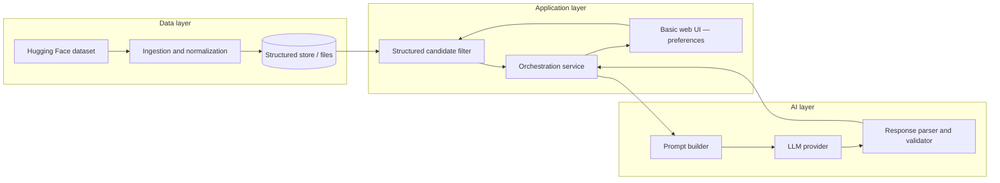
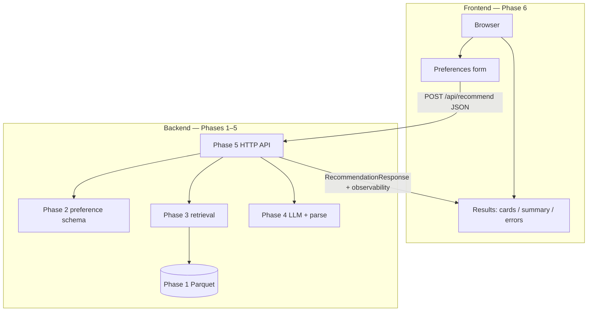

# Phase-Wise Architecture: AI Restaurant Recommendation (Zomato Use Case)

This document maps a phased delivery plan to the workflow in [problemstatement.md](./problemstatement.md). Each phase adds a slice of capability you can demo, test, and iterate on.

---

## High-Level System View

### Backend vs frontend (post–Phase 5)

After Phase 5, treat the system as a **JSON API backend** and a **browser frontend**. The backend owns data, retrieval, LLM calls, validation of business rules, and caching; the frontend owns forms, loading states, rendering recommendation cards, and empty or error UX.

| Layer | Responsibilities | Code / entrypoints |
|-------|------------------|-------------------|
| **Frontend** | Collect user inputs; optional client-side checks; call recommend API; display top N, comparative summary, applied filters; handle empty candidates and API errors | Phase 6 (see below); today [`src/phase2/`](../src/phase2/README.md) provides an SSR **preference demo** only (`/` + form → validate JSON). A full UI should **`fetch` Phase 5** and render `response.recommendations`. |
| **Backend** | ETL and canonical store; structured filters; prompt + LLM + schema validation; orchestration, cache, observability; **authoritative** preference validation on every recommend request | Phase 1 Parquet; [`src/phase3/`](../src/phase3/README.md); [`src/phase4/`](../src/phase4/README.md); [`src/phase5/`](../src/phase5/README.md) — `python -m phase5.run_server`, `POST /api/recommend` |

**Contract:** The browser sends the same shape as `schemas/user-preferences.schema.json` (wrapped in `POST /api/recommend` per [`src/phase5/README.md`](../src/phase5/README.md)). The server returns `RecommendationResponse` in the `response` field plus `observability` for latency and pipeline notes.

**Local dev:** Run backend on port **5055** (default `PHASE5_PORT`). Run Phase 2 on **5050** only if you still need the standalone preference form; configure the frontend origin vs API URL (e.g. CORS) if they differ.

---

## Phase 0 — Scope, Contracts, and Success Criteria

**Goal:** Lock what “good” looks like before building.

| Area | Outcomes |
|------|----------|
| User inputs | Collected via a **basic web UI** (primary): location, budget band, cuisine(s), min rating, optional free-text constraints — same fields as `schemas/user-preferences.schema.json` |
| Output | Top N restaurants with name, cuisine, rating, cost, AI rationale |
| Quality | Rankings respect hard filters; explanations cite preference alignment |
| Non-goals | Clarify (e.g., real-time Zomato API, payments, maps) if not required |

**Architecture artifacts (implemented):**

| Artifact | Path |
|----------|------|
| User preference JSON Schema | `schemas/user-preferences.schema.json` |
| Recommendation response JSON Schema | `schemas/recommendation-response.schema.json` |
| Scope, non-goals, success criteria | `contracts/phase0-scope.json` |
| Golden queries (manual eval) | `contracts/golden-queries.json` |
| Sample valid response (fixture) | `contracts/sample-recommendation-response.json` |
| Validator | `scripts/validate_phase0_contracts.py` → `src/phase0/validate_contracts.py` (requires `requirements-contracts.txt`) |
| Phase 0 implementation notes | [phase0_implementation.md](./phase0_implementation.md) |
| Dataset (raw → canonical) contract | [contracts/dataset_contract.md](../contracts/dataset_contract.md) |

---

## Phase 1 — Data Ingestion and Preparation

**Goal:** Reliable, repeatable access to cleaned restaurant records aligned with [problemstatement.md §1](./problemstatement.md#1-data-ingestion-and-preparation).

**Components**

- **Loader:** Pull dataset from Hugging Face (`datasets` library or export pipeline).
- **Normalizer:** Map raw columns to canonical fields (name, location, cuisines, cost, rating, attributes).
- **Quality checks:** Missing values, type coercion, deduplication rules, location/cuisine normalization (e.g., casing, synonyms).

**Storage options (pick one for MVP)**

- Parquet/CSV + in-memory `pandas`/`polars` for simplicity, or
- SQLite/duckdb for filterable local storage.

**Exit criteria:** Single command or script reproduces the cleaned table; documented field dictionary.

**Implementation:** Python ETL in [`src/phase1/`](../src/phase1/README.md) — `python -m phase1.run_etl` (Hugging Face or local CSV), default outputs under [`phase1/output/`](../phase1/README.md), [field dictionary](../src/phase1/field_dictionary.md).

---

## Phase 2 — User Preference Collection

**Goal:** Capture and validate inputs from [problemstatement.md §2](./problemstatement.md#2-user-preference-collection).

**Components**

- **Preference model:** Strong typing or schema validation (location string, budget enum, cuisine list, min rating float, optional tags).
- **Surface:** **Basic web UI** is the primary input source (Phase 0); optional REST `POST /recommend` or CLI may use the **same JSON preference contract** for tests or integrations.

**Exit criteria:** Invalid combinations rejected with clear errors; defaults documented (e.g., “no cuisine = any”).

**Implementation:** [`src/phase2/README.md`](../src/phase2/README.md) — Flask (`python -m phase2.run_server`), `POST /api/preferences`, `jsonschema`, package `phase2.preferences`, CLI `python -m phase2.validate_cli`. Runtime notes: [`phase2/README.md`](../phase2/README.md). **Shared library:** Phase 5 reuses Phase 2 validation on `POST /api/recommend`; the Phase 2 web UI remains a **validation / JSON preview** surface until Phase 6 wires the form to the recommend API.

---

## Phase 3 — Structured Retrieval (Candidate Generation)

**Goal:** Deterministic shortlist before the LLM, per [problemstatement.md §3](./problemstatement.md#3-retrieval-and-llm-integration).

**Components**

- **Filter engine:** SQL/pandas filters on location, budget, cuisine overlap, min rating.
- **Cap:** Limit to top *K* candidates (e.g., 15–30) to control tokens and latency.
- **Ranking signal (optional, pre-LLM):** Simple score (rating × budget fit × cuisine match) for tie-breaking or ordering in the prompt.

**Exit criteria:** Same inputs always yield the same candidate set; unit tests on filter logic.

**Implementation:** [`src/phase3/README.md`](../src/phase3/README.md) — package `phase3.retrieval` (`retrieve_candidates`, `load_canonical_parquet`), CLI `python -m phase3.retrieve_cli`. Default table path: [`phase1/output/`](../phase1/README.md). Runtime notes: [`phase3/README.md`](../phase3/README.md).

---

## Phase 4 — LLM Integration Layer

**Goal:** Turn structured candidates + user prefs into ranked, explained output, per [problemstatement.md §3–4](./problemstatement.md#3-retrieval-and-llm-integration).

**Components**

- **Prompt builder:** Injects user prefs, candidate table (compact), ranking rules, and **strict output format** (JSON or markdown sections).
- **LLM adapter:** Pluggable provider; temperature and max tokens tuned for consistency.
- **Parser/validator:** Parses model output; falls back or retries on malformed responses.
- **Guardrails:** Instruction to only recommend from provided candidates; no invented venues.

**Exit criteria:** Parsed responses match schema; failure modes handled (timeout, empty candidates).

**Implementation:** [`src/phase4/README.md`](../src/phase4/README.md) — Groq chat adapter (`phase4.llm.groq_adapter`), prompt builder, JSON parse + `jsonschema` validation against `schemas/recommendation-response.schema.json`, retries and deterministic fallback (`recommend_with_groq`), CLI `python -m phase4.recommend_cli`. Runtime notes: [`phase4/README.md`](../phase4/README.md).

---

## Phase 5 — Recommendation Orchestration and API

**Goal:** One cohesive path from request to response for [problemstatement.md §4–5](./problemstatement.md#4-recommendation-generation).

**Components**

- **Orchestrator:** `preferences → filter → prompt → LLM → validate → top N`.
- **Caching (optional):** Cache by hash of (prefs + dataset version) for repeat queries.
- **Observability:** Log prompt size, latency, filter counts, and parse failures (no PII in logs unless allowed).

**Exit criteria:** End-to-end latency acceptable for demo; idempotent behavior for same request.

**Implementation:** [`src/phase5/README.md`](../src/phase5/README.md) — package `phase5` (`run_recommendation`, optional LRU/disk cache, structured logs), HTTP `POST /api/recommend` via `python -m phase5.run_server`, CLI `python -m phase5.cli`. Runtime notes: [`phase5/README.md`](../phase5/README.md).

---

## Phase 6 — Output Presentation (frontend)

**Goal:** User-facing clarity per [problemstatement.md §5](./problemstatement.md#5-output-presentation), implemented as the **frontend** in the split above.

**Components**

- **Primary integration:** Call **`POST /api/recommend`** (Phase 5) with `{ "preferences": { … }, "cap", "top_n", "use_llm" }`; render `response.recommendations` and optional `response.comparative_summary`.
- **Layout:** Cards or table rows with name, cuisine, rating, estimated cost, `ai_rationale`; show `observability.candidate_count` or a short “why these?” line when useful (without exposing raw logs).
- **UX:** Loading and error states (4xx validation, 503 missing dataset); **empty state** when `recommendations` is empty; responsive layout (mobile/desktop).
- **Implementation options (pick one for MVP):** (a) Extend Phase 2 templates + small JS to POST to `http://127.0.0.1:5055/api/recommend`; (b) static HTML/JS or a lightweight SPA served separately; (c) keep Phase 2 as dev-only and build a minimal single-page demo. **CORS:** Enable on Phase 5 if the frontend is served from another origin/port.

**Exit criteria:** Readable on mobile/desktop; empty state when no candidates match; errors from the API surfaced in plain language.

**Implementation:** [`src/phase6/README.md`](../src/phase6/README.md) — Flask frontend app (`python -m phase6.run_server`) with form + JS fetch to same-origin `/api/recommend` (Phase 6 proxy to Phase 5), recommendation cards, comparative summary, and loading/error/empty states. Runtime notes: [`phase6/README.md`](../phase6/README.md).

**Next.js UI mockups:** Copy-paste prompt for **Google Stitch** (screens + component handoff) in [`docs/google-stitch-nextjs-ui-prompt.md`](./google-stitch-nextjs-ui-prompt.md).

---

## Phase 7 — Evaluation, Safety, and Hardening

**Goal:** Trust and maintainability beyond the MVP.

| Track | Actions |
|-------|---------|
| Correctness | Golden-set queries; assert all returned IDs/names ⊆ candidate set |
| Relevance | Human spot-checks or simple metrics (rating threshold never violated) |
| Safety | Refusal/soft handling for harmful or ambiguous constraint abuse |
| Ops | Config for dataset path, model name, API keys via environment |

**Exit criteria:** Short eval checklist documented; known limitations listed.

**Implementation:** [`phase7-nextjs/README.md`](../phase7-nextjs/README.md) — Next.js hardening app with Phase 5 proxy routes, safety soft-checks, recommendation integrity checks, and golden-query evaluation page (`/eval`). Evaluation checklist + known limitations: [`docs/phase7-eval-checklist.md`](./phase7-eval-checklist.md).

---

## Phase 8 — Deployment (Streamlit)

**Goal:** Publish a **hosted demo** of the recommendation flow using **Streamlit**, so stakeholders can try the system without running Flask, Next.js, or CLIs locally. Complements Phase 6/7 UIs by optimizing for fast iteration and free managed hosting.

**Components**

- **Streamlit app:** Preference inputs (`st.form` / widgets) aligned with `schemas/user-preferences.schema.json`; display top N results, comparative summary, and clear empty/error states—either by **importing** `phase5.run_recommendation` (same process as the backend) or by **HTTP `POST /api/recommend`** to a separately deployed Phase 5 service (useful when the API is already public).
- **Secrets and config:** API keys, dataset path, and model settings via `st.secrets` and environment variables—**never** committed to the repo.
- **Hosting (free tier):** [Streamlit Community Cloud](https://streamlit.io/cloud) — connect the GitHub repository, set the main file to your Streamlit entrypoint (e.g. `streamlit run src/phase8/app.py`), and configure secrets in the app dashboard. Alternatives in the same spirit: self-host Streamlit behind a reverse proxy on Render/Fly if you outgrow Community Cloud limits.

**Exit criteria:** Stable public URL for the demo app; secrets only in Streamlit Cloud (or host) secret stores; README documents local `streamlit run …` and deploy steps.

**Implementation:** [`src/phase8/README.md`](../src/phase8/README.md) — Streamlit app (`streamlit run src/phase8/app.py`, `PYTHONPATH=src`); in-process orchestration or `PHASE8_API_BASE` HTTP mode; depends on Phases 1–5 for data and orchestration (and optionally Phase 5 deployed separately when using HTTP mode). Optional root file [`requirements-streamlit.txt`](../requirements-streamlit.txt) for Streamlit Cloud dependency resolution.

---

## Phase-to-Problem-Statement Traceability

| Problem statement section | Primary phases |
|---------------------------|----------------|
| §1 Data ingestion | Phase 1 |
| §2 User input | Phase 2 (schema); Phase 6 (form UX) |
| §3 Retrieval + prompt | Phases 3–4 (backend) |
| §4 Recommendation generation | Phases 4–5 (backend) |
| §5 Output display | Phase 6 (frontend) |
| Expected outcome (trust, relevance) | Phases 3–7 |
| Hosted demo / sharing | Phase 8 (Streamlit deployment) |

---

## Suggested Implementation Order (Minimal Path)

1. Phase 1 → load and clean data  
2. Phase 3 → filters only (baseline recommendations without LLM)  
3. Phase 2 + 5 → preferences + orchestration wrapping filters (**backend** ready)  
4. Phase 4 → add LLM ranking and explanations  
5. Phase 6 → **frontend** calling Phase 5 (`POST /api/recommend`), cards + empty/error states  
6. Phase 7 → tests and evals  
7. Phase 8 → Streamlit packaging + Streamlit Community Cloud (or equivalent) for a **shareable hosted demo**

This order delivers a working **backend** early, then a proper **frontend** on top, then hardening, then optional **managed deployment** of a lightweight UI.
